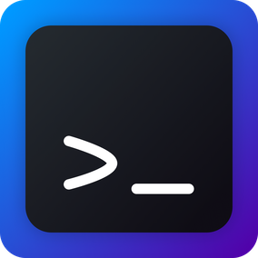
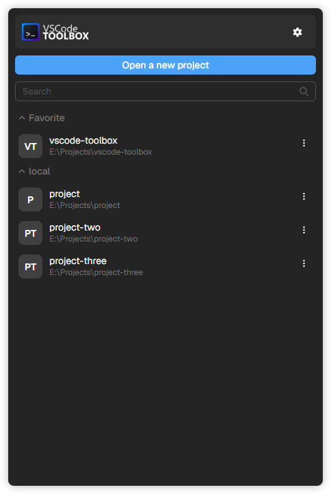

<p align="center">
  <a href="https://github.com/trenlok/vscode-toolbox">
    
  </a>
</p>

<h1 align="center">VSCode toolbox</h1>

<p align="center">
A lightweight toolbox for Visual Studio Code
</p>

<p align="center">
  <a href="LICENSE">
    
  </a>
  
  <a href="https://tauri.app/">
    
  </a>
</p>


<div align="center">

</div>

## ✨ Features
- 🗂️ **Project Management**: Organize and manage multiple projects.
- ⚙️ **Rust Core**: Built for performance, low latency, and stability.
- 🪶 **Lightweight UI**: Powered by Tauri v2 and Nuxt 4 (no Electron overhead).
- 🆓 **Open Source**: MIT licensed and free to use.

## 🚀 Quick Start

### Installation
1. Download the latest release from the [**Releases**](https://github.com/trenlok/vscode-toolbox/releases) page.
2. Install and launch the application.
3. Add your projects and open them in VSCode.

### Requirements

- Windows 10 or higher  
- [Visual Studio Code](https://code.visualstudio.com/) installed and added to your `PATH`.

## 🛠️ Tech Stack
- [Nuxt v4](https://nuxt.com/) with [TypeScript](https://www.typescriptlang.org/)
- [Tauri v2](https://tauri.app/)
- [Rust](https://www.rust-lang.org/)
- [pnpm](https://pnpm.io/)
- [SCSS](https://sass-lang.com/)
- [Font Awesome](https://fontawesome.com/) (under [CC BY 4.0](https://fontawesome.com/license/free))

## 🛠️ Development

### ✅ Prerequisites

- [Node.js](https://nodejs.org/) (v24+)
- [Rust](https://rustup.rs/)

You can find out more details [here](https://v2.tauri.app/start/prerequisites/)

### 🚀 Run in Development

```bash
pnpm install --frozen-lockfile
pnpm run tauri:dev
```

### 📦 Build for Production

```bash
pnpm run tauri:build
```

### 🐞 Debug

```sh
$ pnpm run tauri:build:debug
```

The same Tauri bundle will generate under `src-tauri/target`, but with the ability to open the console.


### 🧹 Lint & Format

```sh
$ pnpm lint
$ pnpm format
```

## 🤝 Contributing

Contributions are welcome!  
If you have ideas, feel free to open an issue or submit a pull request.

## 🛡️ License

[MIT](LICENSE)
